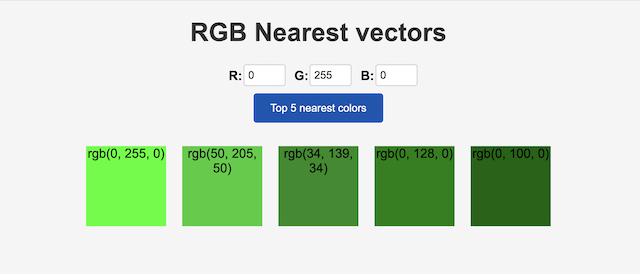

[](https://gitpod.io/#https://github.com/Aiven-Labs/quarkus-pgvector-rgb-finder)


# RGB Nearest vectors

A simple project which demonstrates vector similarity search using Postgres/PG-Vector/Quarkus with Hibernate Panache.

At startup, the DB will be loaded with 64 different colors, represented as vector, i.e `[0,128,0]` (green) and stored in a `vector` column. The app provides a simple Web page where you can specify a RGB value, it will return the 5 closest colors.

## Setup

You will a need a Postgres instance with the `pg-vector` extension.

You can get a completely **free** Postgres instance on Aiven, use this special referral [link](https://go.aiven.io/sebi-signup) to get extra credits to try out the other services ("Apache Kafka", "Clickhouse", "Apache Flink" etc ...), no credit cards asked.

If you are using `Gitpod` , the Aiven CLI `avn` is already installed for you, so you can do : 

```

avn user login 

```

and then : 

```
avn service create postgres-rgb  -t pg --plan  free-1-5gb --cloud do-ams
```


Once connected to your DB (with `psql` for instance, which is already installed for you if you are using `Gitpod`, check (Aiven doc)[https://docs.aiven.io/docs/products/postgresql/getting-started] ) , type : 

```
CREATE EXTENSION vector;
```

In the `src/main/resources/application.properties` set the correct values for your db. 


## Running the application in dev mode


```shell script
./mvnw quarkus:dev
```

Browse to "localhost:8080" 



